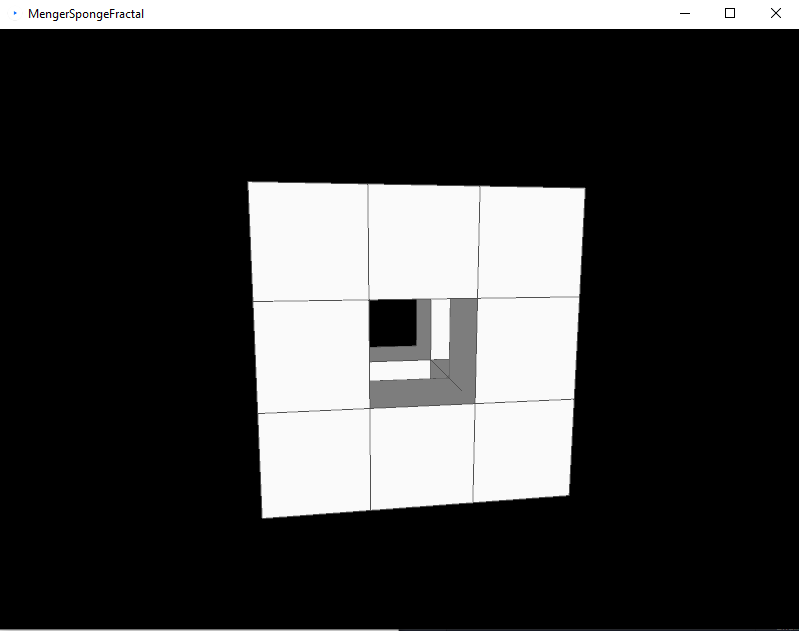
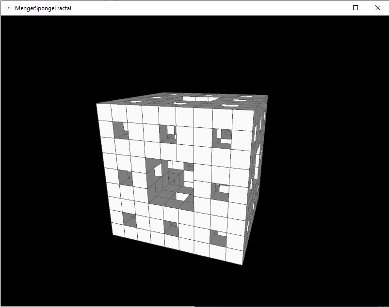

# Menger Sponge Fractal

[Menger Sponge Fractal](https://en.wikipedia.org/wiki/Menger_sponge) drawn using
[Processing](https://processing.org/)

## Usage

[Download](https://processing.org/download) Processing and then open and run
```MengerSpongeFractal.pde```

Click on the cube to generate next fractal. Note: Clicking many times will slow down the app

## Screenshots

 
 